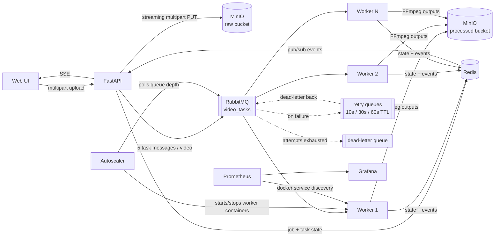

# Distributed Video Processing Platform

A cloud-native platform that accepts large video uploads, stores them in
S3-compatible object storage and processes into independent tasks on a
message queue. Executes them across a horizontally scalable, fault-tolerant
worker fleet — with live progress via SSE and full observability through
Prometheus + Grafana.

## Architecture



**Flow.** A video is uploaded through the web UI. The API streams it directly
into MinIO using multipart upload (the file is never buffered in memory), then
splits the job into five independent tasks — 1080p transcode, 720p transcode,
thumbnail, preview clip, metadata extraction — and publishes them to RabbitMQ.
Workers consume with `prefetch=1` (fair dispatch), run FFmpeg, write outputs to
the processed bucket, and update job state in Redis. Every state change is
published on a Redis pub/sub channel that the API relays to the browser as
Server-Sent Events. An autoscaler polls queue depth and adds or removes worker
containers between configured bounds.

## Reliability design

- **At-least-once delivery, idempotent consumers.** Workers use manual acks;
  a message is only acked after its outcome is decided. Because redelivery can
  duplicate work, every task checks Redis first and skips tasks already in a
  terminal state.
- **Retries with backoff, without blocking.** Failed tasks are re-published to
  TTL "parking" queues (10s → 30s → 60s) whose dead-letter target is the main
  queue. Escalating fixed-TTL queues avoid RabbitMQ's per-message-TTL
  head-of-line blocking problem.
- **Dead-letter queue.** After 4 total attempts a task lands in
  `video_tasks.dlq` with its error recorded on the job, and the job completes
  as `completed_with_errors` instead of hanging forever.
- **Crash safety.** If a worker dies mid-task, the unacked message is redelivered
  to another worker. Scale-down stops containers with a 60s grace period so
  in-flight FFmpeg runs finish or requeue cleanly.

## Scaling & observability

- Workers are stateless; `docker compose up --scale worker=N` or the
  autoscaler (queue-backlog / `TASKS_PER_WORKER`, clamped to min/max, with
  scale-down hysteresis to prevent flapping) adjusts the fleet.
- Prometheus discovers workers through Docker service discovery (label
  `com.videopipeline.role=worker`), so autoscaled containers are scraped
  automatically. RabbitMQ exposes its own Prometheus plugin metrics.
- Grafana ships pre-provisioned with a dashboard: queue depth, active workers,
  task throughput/latency p95 by type, retries, dead letters, uploads, jobs
  completed.

## Run it

Requires Docker Desktop (or engine) with Compose v2.

```bash
cp .env.example .env
docker compose up -d --build
./scripts/smoke_test.sh        # end-to-end: generate video -> upload -> wait for completion
```

| Endpoint | URL |
|---|---|
| Web UI (upload + live progress) | http://localhost:8080 |
| Grafana dashboard | http://localhost:3000 (admin/admin) |
| RabbitMQ management | http://localhost:15672 (guest/guest) |
| Prometheus | http://localhost:9090 |
| MinIO console | http://localhost:9001 (minioadmin/minioadmin) |

Manual scaling: `make scale N=4`. Unit tests: `pip install -r tests/requirements.txt && make test`.

### Demo script (2 minutes)

1. Open the UI and Grafana side by side.
2. Upload 3–4 videos quickly; watch queue depth spike and task chips turn green live.
3. Watch the autoscaler log (`docker compose logs -f autoscaler`) add workers,
   then remove them after the backlog drains.
4. Kill a worker mid-job (`docker kill <worker>`) — the task is redelivered and
   the job still completes. This is the money shot for fault tolerance.

## Repository layout

```
api/          FastAPI service: upload, jobs, SSE, static web UI
worker/       queue consumer + FFmpeg task execution
autoscaler/   queue-depth-based container autoscaler
common/       shared pure logic: task planning, retry policy, topology, state
infra/        prometheus, grafana provisioning, rabbitmq plugins
tests/        unit tests (pure logic + state machine, fakeredis)
scripts/      end-to-end smoke test
```
